# 🏪 Sari-Sari Store Management System

> A desktop Point-of-Sale and Inventory Management application built with Java Swing, designed specifically for small Philippine retail stores (sari-sari stores).

---

## 📋 Table of Contents

- [Overview](#overview)
- [Features](#features)
- [Tech Stack](#tech-stack)
- [Project Structure](#project-structure)
- [Database Schema](#database-schema)
- [Getting Started](#getting-started)
- [Dependencies](#dependencies)
- [Security](#security)
- [Screenshots](#screenshots)

---

## Overview

The **Sari-Sari Store Management System** is a full-featured desktop application that helps small store owners manage their day-to-day operations. It covers everything from processing sales at the counter to tracking inventory levels, managing suppliers, viewing sales analytics, and configuring store settings — all in one place.

Each store owner gets their own isolated account with data scoped to their store, making the system safe for multi-tenant use on a shared database.

---

## Features

### 🔐 Authentication
- Secure login with **BCrypt password hashing** (work factor 12)
- Auto-migration of legacy plain-text passwords on first login
- **Forgot password** recovery via registered phone number — two-step flow (phone lookup → password reset)
- New account registration with automatic store creation

### 📦 Inventory Management
- Add, edit, and delete products with stock quantities
- Low stock and out-of-stock alerts on the dashboard
- Product categorization
- Inventory log tracking (who changed what and when)
- Disposed items tracking

### 💰 Point of Sale (POS)
- Fast order entry with product search
- Real-time stock deduction on sale
- Transaction receipt generation

### 📊 Sales History & Analytics
- Full transaction history per user/store
- Sale items breakdown per transaction
- Date-range filtering
- **Charts powered by XChart:**
  - 📈 Daily Revenue Trend (line chart)
  - 🥧 Product Mix (pie chart with legend)
  - 🏆 Top 5 Products by Units Sold (bar chart)

### 🚚 Supplier Management
- Add and manage suppliers linked to your store

### 🏷️ Category Management
- Organize products into custom categories per store

### 👤 Profile & Settings
- Update full name, username, and phone number
- Change store name and upload a store logo
- **Database backup** — exports all store data to a `.sql` file
- **Database restore** — re-imports a backup with full rollback on failure

### 🗄️ Dashboard
- Today's sales total and transaction count
- Low stock and out-of-stock item counts
- Quick action cards for all major modules
- Store logo and name displayed throughout the UI

---

## Tech Stack

| Layer | Technology |
|---|---|
| Language | Java 17+ |
| UI Framework | Java Swing (custom-painted components) |
| Database | MySQL 8.0+ |
| JDBC Driver | MySQL Connector/J |
| Password Hashing | jBCrypt 0.4 |
| Charts | XChart 3.8.x |
| Build | Manual / NetBeans / IntelliJ |

---

## Project Structure

```
src/
├── config/
│   └── DatabaseConnection.java     # JDBC connection pool/factory
├── dao/
│   └── userDAO.java                # User authentication, registration, store lookup
├── model/
│   └── User.java                   # User entity (userId, username, password, fullName, phoneNumber, storeId)
└── view/
    ├── LoginFrame.java             # Login screen with forgot password link
    ├── RegisterFrame.java          # New account + store registration
    ├── ForgotPasswordDialog.java   # Two-step phone-based password reset
    ├── DashboardFrame.java         # Main app shell with sidebar navigation
    ├── InventoryPanel.java         # Product inventory management
    ├── POSPanel.java               # Point of sale interface
    ├── SalesHistoryPanel.java      # Transaction history + charts
    ├── InventoryLogPanel.java      # Inventory change log
    ├── Disposeditemspanel.java     # Disposed items tracker
    ├── SuppliersPanel.java         # Supplier management
    ├── CategoryPanel.java          # Product category management
    └── ProfileSettingsPanel.java   # Account, store settings, backup/restore
```

---

## Database Schema

```sql
-- Core tables
users        (user_id, username, password, full_name, phone_number, created_at, store_id)
store        (store_id, store_name, store_logo)

-- Inventory
products     (product_id, product_name, stock_quantity, price, category_id, store_id, ...)
categories   (category_id, category_name, store_id)
supplier     (supplier_id, supplier_name, ..., store_id)
inventory_logs (log_id, product_id, user_id, change_type, quantity, created_at)
disposed_items (disposed_id, product_id, quantity, reason, store_id, disposed_at)

-- Sales
sales        (sale_id, user_id, total_amount, created_at)
sale_items   (item_id, sale_id, product_id, quantity, price)
```

---

## Getting Started

### Prerequisites
- Java 17 or higher
- MySQL 8.0 or higher
- An IDE (NetBeans, IntelliJ IDEA, or Eclipse)

### 1. Clone the repository
```bash
git clone https://github.com/your-username/sari-sari-pos.git
cd sari-sari-pos
```

### 2. Set up the database
Create a MySQL database and run your schema SQL. Then add the `phone_number` column if not already present:
```sql
ALTER TABLE users
    ADD COLUMN phone_number VARCHAR(20) NULL DEFAULT NULL
    AFTER full_name;
```

### 3. Configure the database connection
Edit `src/config/DatabaseConnection.java` and update:
```java
private static final String URL      = "jdbc:mysql://localhost:3306/your_database";
private static final String USERNAME = "your_mysql_username";
private static final String PASSWORD = "your_mysql_password";
```

### 4. Add required JAR dependencies
Download and add to your project's build path:

| Library | Version | Download |
|---|---|---|
| MySQL Connector/J | 8.x | https://dev.mysql.com/downloads/connector/j/ |
| jBCrypt | 0.4 | https://repo1.maven.org/maven2/org/mindrot/jbcrypt/0.4/jbcrypt-0.4.jar |
| XChart | 3.8.x | https://knowm.org/open-source/xchart/ |

### 5. Build and run
Open the project in your IDE, resolve the dependencies, and run `LoginFrame.java` as the main entry point.

---

## Dependencies

### jBCrypt — Password Hashing
```
Download: https://repo1.maven.org/maven2/org/mindrot/jbcrypt/0.4/jbcrypt-0.4.jar
```
Used for BCrypt password hashing with a work factor of 12. Existing plain-text passwords are automatically rehashed on the user's next login — no manual migration required.

### XChart — Charts & Graphs
Used to render the line, pie, and bar charts in the Sales History panel.

### MySQL Connector/J
Standard JDBC driver for MySQL connectivity.

---

## Security

| Concern | Implementation |
|---|---|
| Password storage | BCrypt with cost factor 12 (never stored as plain text) |
| Legacy passwords | Auto-rehashed on first login — transparent to users |
| Password recovery | Phone number lookup — no email dependency |
| SQL injection | All queries use `PreparedStatement` with parameterized inputs |
| Data isolation | All queries filter by `user_id` or `store_id` — users only see their own data |
| Backup files | Plain SQL exports scoped to the logged-in user's store only |

> **Note:** This application stores passwords using BCrypt. If you find any plain-text passwords in the database from before the security update was applied, they will be automatically migrated to BCrypt on the user's next successful login.

---

## 📸 Screenshots

### Login Screen
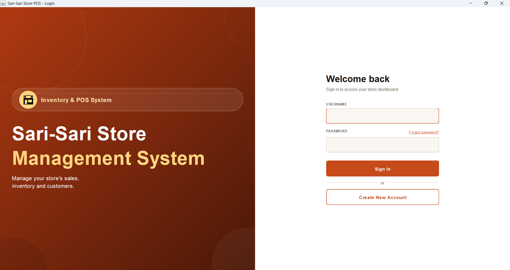

### Register Screen
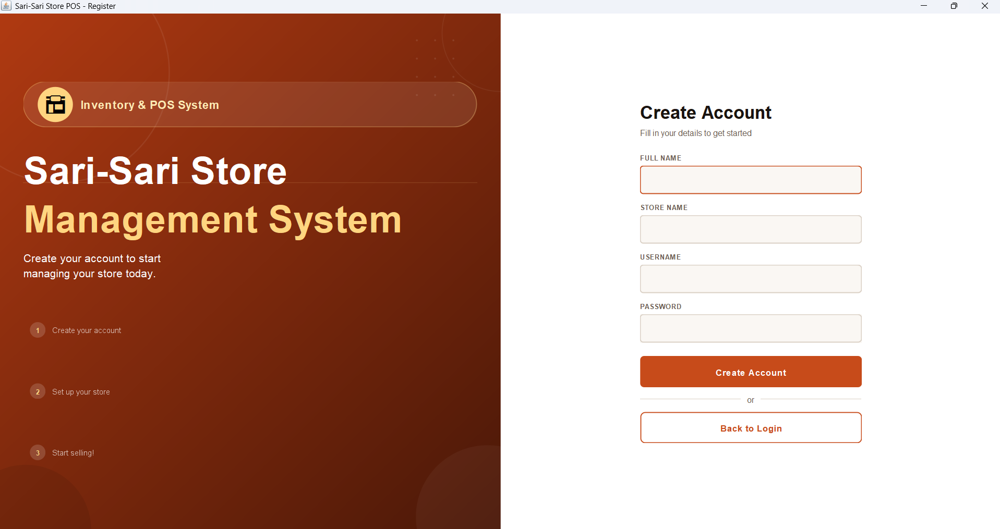

### Dashboard
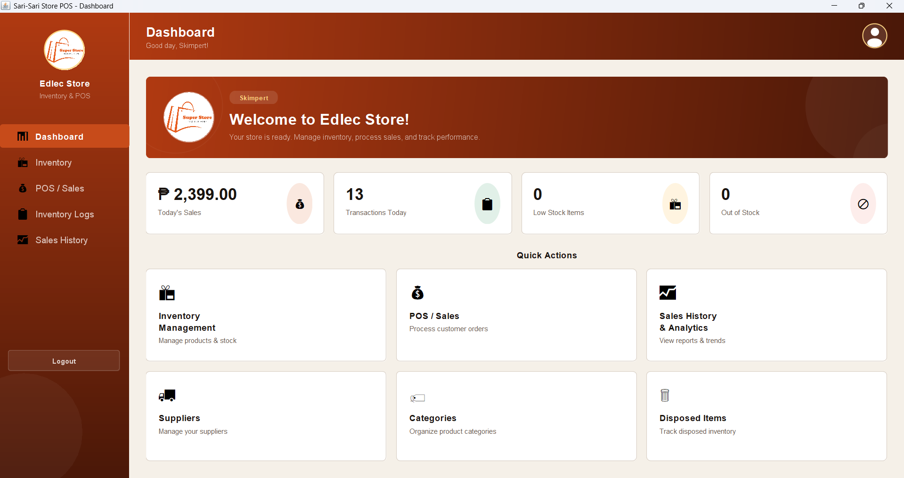

### Inventory Management
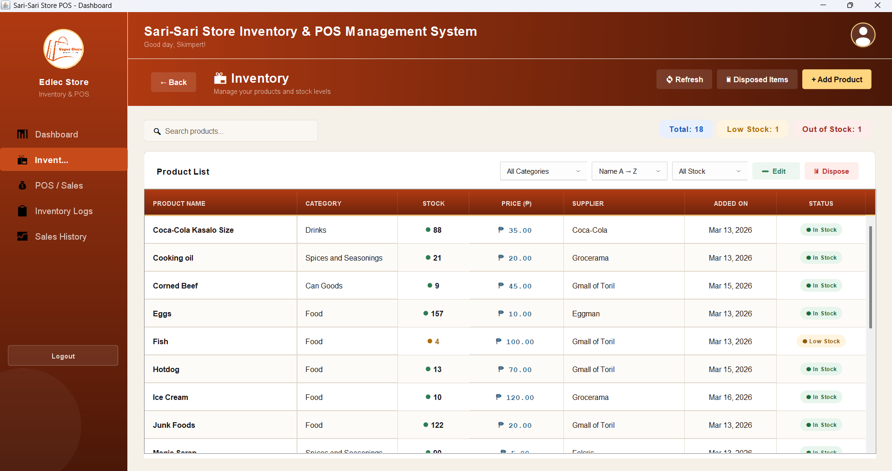

### Point of Sale (POS)
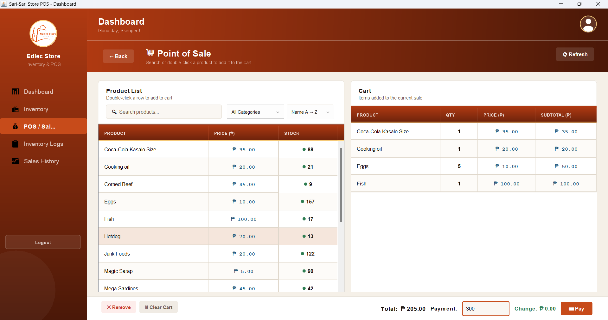

### Inventory Logs
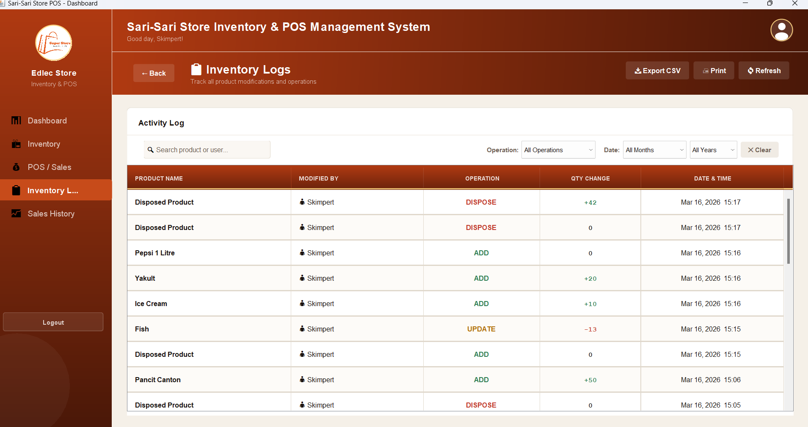

### Analytics Charts
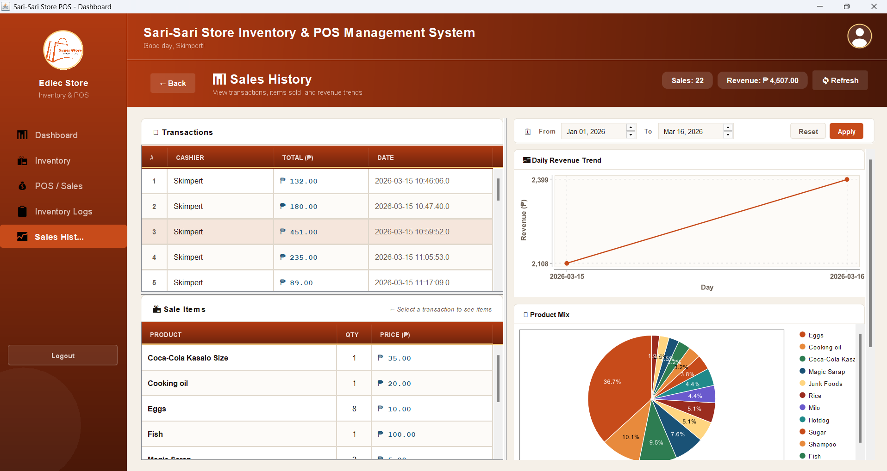

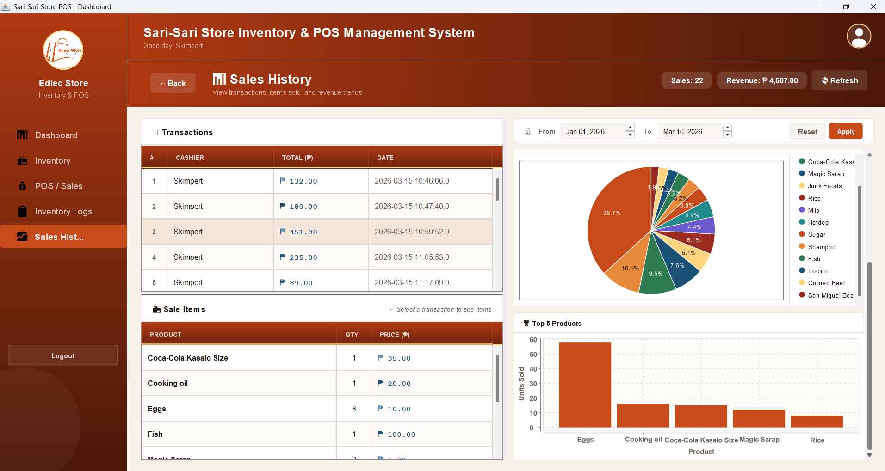

### Profile and Settings
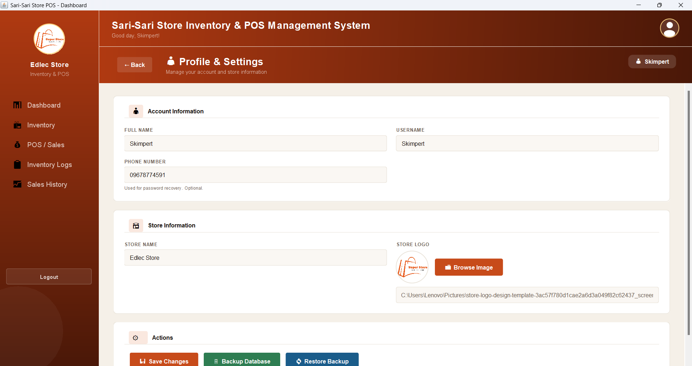

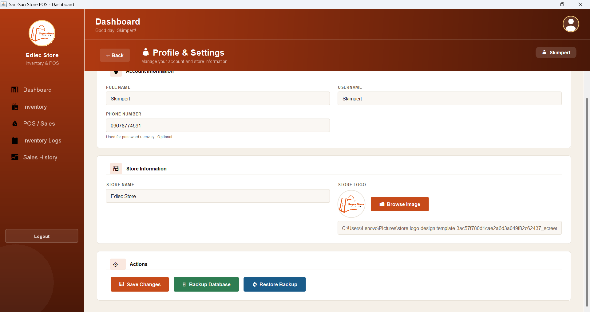

### Supplier Management
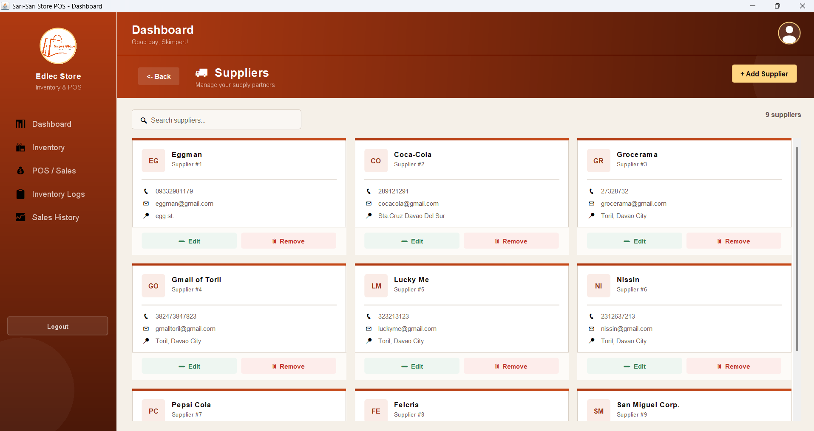

### Inventory Logs
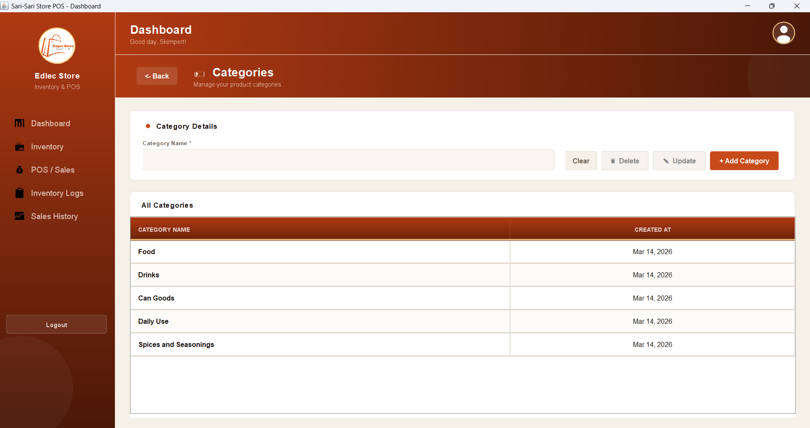

### Disposed Items
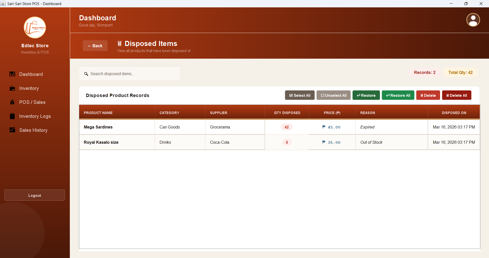

## Color Palette

The UI uses a consistent warm brown/terracotta theme throughout:

| Token | Hex | Usage |
|---|---|---|
| Accent | `#C74B1A` | Buttons, active nav, focus rings |
| Left Top | `#B03A12` | Gradient top (header, sidebar) |
| Left Bot | `#4A1808` | Gradient bottom |
| Background | `#F5F0E8` | App background |
| Card | `#FFFFFF` | Card surfaces |
| Text | `#1A1410` | Primary text |
| Muted | `#6B5E52` | Secondary text, labels |
| Gold | `#FFD580` | Accents, table header underline |
---

## License

This project is developed as an academic/personal project. All rights reserved by the author.

---

<p align="center">Built with ☕ Java and a lot of <code>paintComponent()</code> overrides</p>
